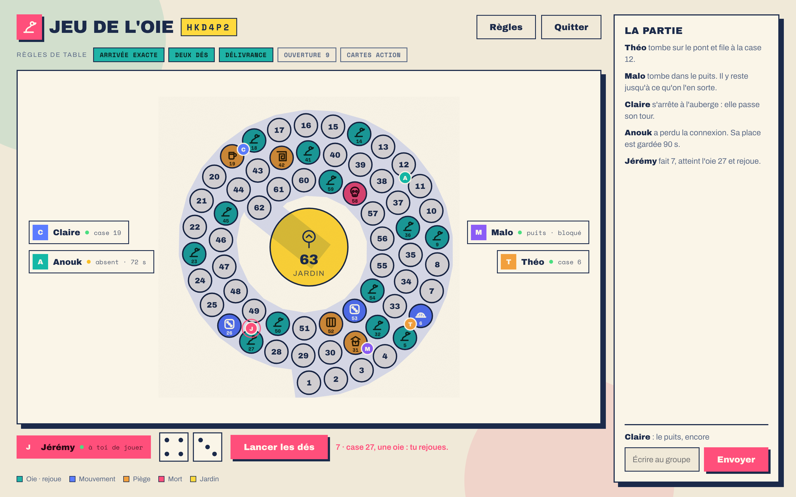
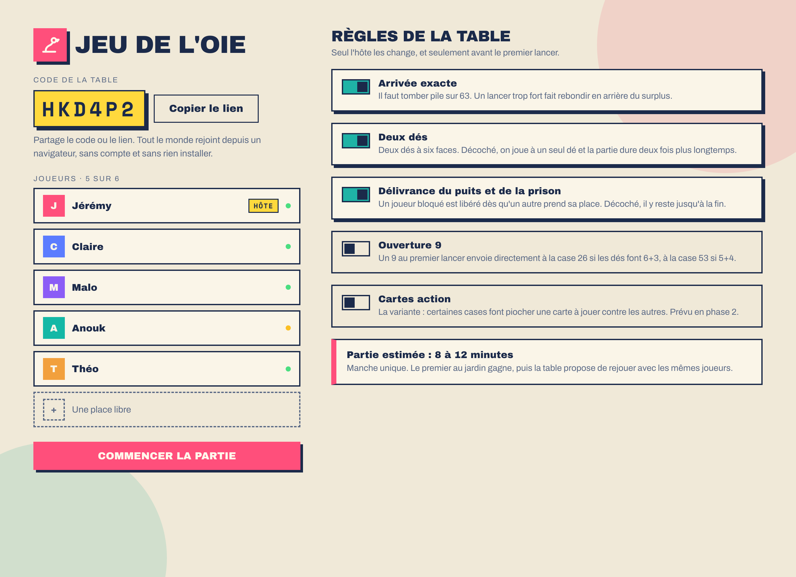
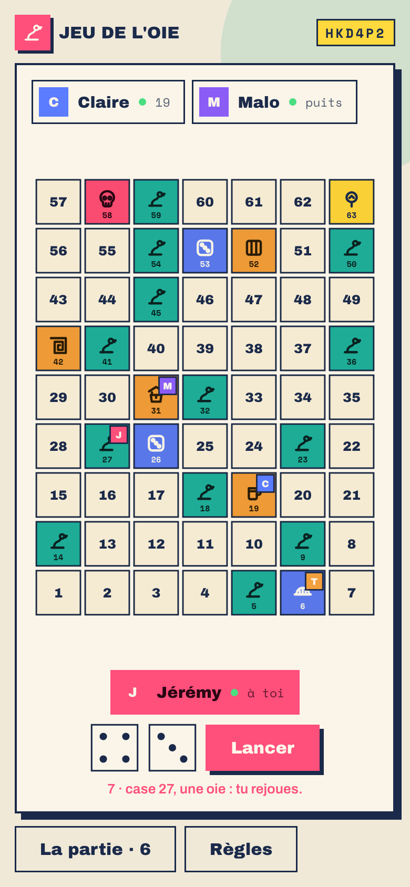
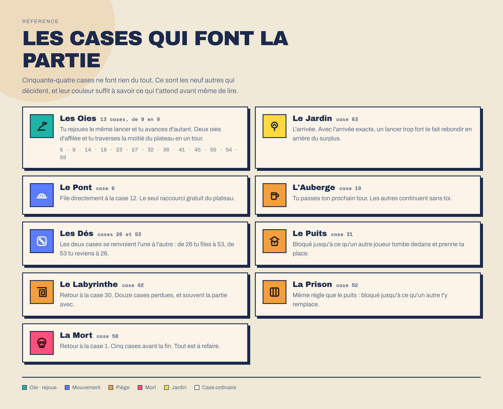
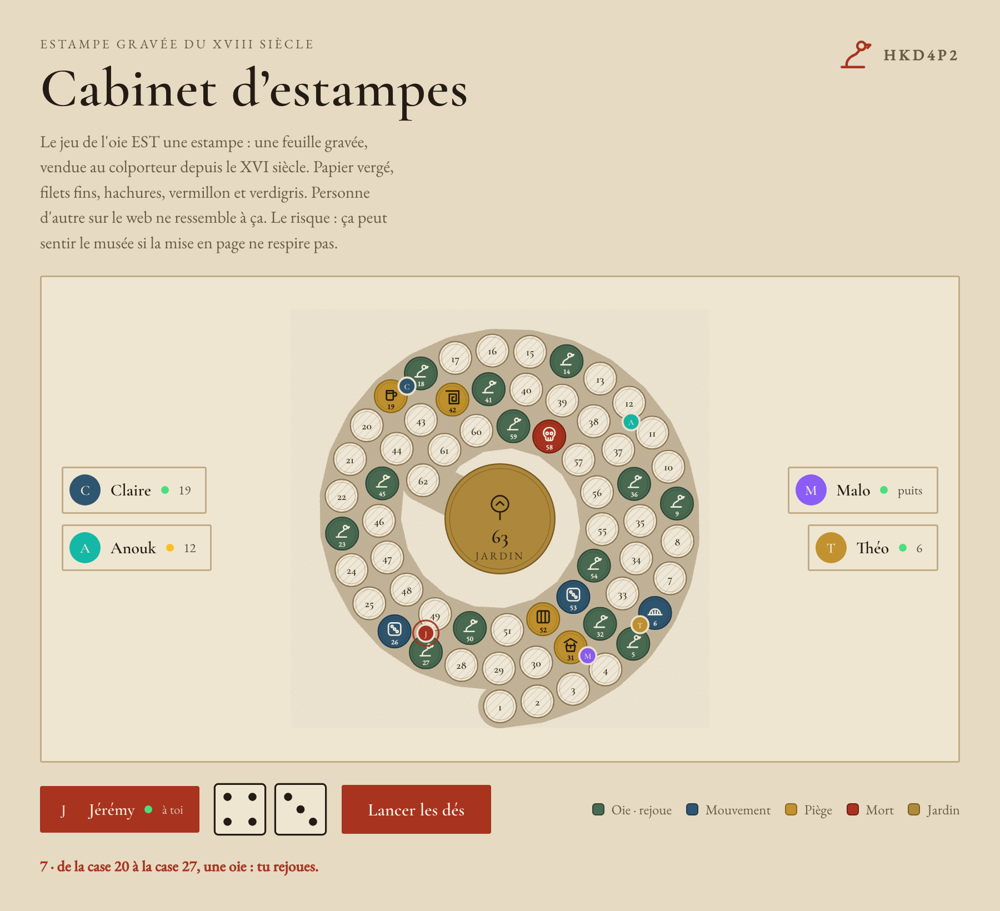

# goose-multiplayer

Jeu de l'oie en ligne, 2 à 6 joueurs, TypeScript, serveur autoritaire,
auto-hébergé. Le moteur, le serveur et le client navigateur sont en place :
deux onglets suffisent pour jouer une partie complète.

## Lancer le jeu

```bash
npm install
npm run build          # le serveur sert le bundle du client, il faut le construire
npm start -w @goose/server   # port 5050
npm run dev -w @goose/web    # port 5173, proxy /socket.io et /healthz vers 5050
```

Le port 5050 plutôt que 5000 : sur macOS, Control Center occupe le 5000 pour
AirPlay et la panne ressemble à un 403 renvoyé par un serveur que personne n'a
démarré.

Ouvrir <http://localhost:5173> dans deux onglets. Le premier crée la table, le
second rejoint avec le code à six caractères. Chaque onglet garde un jeton de
session dans `localStorage` : un rafraîchissement ou une coupure réseau
retrouve le même siège au lieu d'attendre les 90 secondes de grâce.

Contrôles :

```bash
npm run verify         # lint, typecheck, tests
npm run format:check
```

Le client ne connaît aucune règle. Le serveur envoie `legalMoves` dans chaque
vue ; le client affiche ce qu'il reçoit et émet des intentions.

Un double aux deux dés redonne la main au même siège, trois fois de suite au
maximum. L'hôte choisit ce que coûte le troisième : le tour passe, ou le siège
repart de la case 0. Règle maison activée par défaut, inerte et grisée avec un
seul dé.

On sort du puits et de la prison par trois portes, et non plus par une seule :
un autre joueur prend la place (sauvetage), un double libère et fait avancer du
même lancer, ou le piège relâche son joueur au bout de trois de ses propres
tours. Un siège bloqué **prend son tour** et lance : il joue au lieu de
regarder. La plaque du siège affiche le décompte, « Au puits · encore 2
essais », parce qu'un pion bloqué sans échéance visible est exactement ce que
ces règles corrigent. L'hôte règle tout cela dans le salon, jusqu'à la table
historique où seul un sauvetage ouvre le piège. `scripts/measure-blocking.ts`
mesure ce que cela change, et le § 3 du design en garde les chiffres.

Le lancer se joue plutôt qu'il ne s'affiche : les dés partent d'une face vide,
roulent 900 ms puis se posent sur le résultat, et le pion marche la chaîne
étape par étape, 450 ms chacune, le fil de la partie au même rythme. Le serveur
connaît le résultat avant l'animation ; le client le retient jusqu'à ce que les
dés se posent. `prefers-reduced-motion: reduce` affiche tout d'un coup.

Chaque règle qui se déclenche porte son propre type d'étape dans le moteur :
le neuf d'ouverture, le pont, les dés, l'auberge, le puits, la prison, le
labyrinthe, la mort, les oies, le rebond sur 63, les trois sorties de piège
(sauvetage, double libérateur, peine purgée) et l'essai manqué, le double, le
troisième double, le jardin, l'arrivée libre et la table bloquée. Une règle que
le client devrait deviner en comparant deux cases est une règle que le joueur
devine aussi, donc le moteur la nomme. `STEP_KINDS`, dans `@goose/protocol`,
tient la liste des deux côtés du fil : une règle ajoutée au moteur et oubliée
là casse la compilation.

Quand une règle se déclenche, une fiche apparaît **à côté** du plateau, jamais
par-dessus : l'icône de la case, le nom de la règle et une phrase qui dit
pourquoi la règle existe, pas ce qu'elle vient de faire. Elle s'efface au bout
de trois secondes ou au clic, et plusieurs règles dans une même chaîne
s'enfilent au lieu de s'empiler. Le bouton de lancer reste baissé tant qu'une
fiche est à l'écran, pour qu'un tour ne soit pas doublé par le suivant. Sous
`prefers-reduced-motion: reduce`, la fiche n'a pas de minuteur et ne retient
rien : elle attend le clic.

Les téléports volent la spirale au lieu de sauter d'une case à l'autre : le
pion suit le tracé imprimé en 1,2 s quelle que soit la distance, en laissant
une traînée derrière lui. Six cases depuis le pont ou cinquante-trois depuis
le neuf d'ouverture prennent le même temps, donc la table n'attend jamais. Les
deux rendus le font, la spirale comme le serpentin en grille. Sous
`prefers-reduced-motion: reduce`, le pion est directement à l'arrivée.

## Docker

L'image sert l'API, les WebSockets et le bundle du client sur un seul port.

```bash
docker compose up --build -d
curl -fsS http://localhost:5050/healthz   # {"status":"ok"}
docker compose down
```

Les deux étages du `Dockerfile` suivent `.nvmrc`, pas le plancher `engines` de
`package.json` : `engines` dit ce que le code supporte encore, `.nvmrc` dit la
version que la CI lint, couvre et joue au navigateur. `scripts/check-node-versions.sh`
échoue quand les deux divergent, parce qu'elles ont déjà divergé en silence.

`compose.traefik.yaml` déploie derrière un Traefik existant : trois
remplacements à faire, aucun mapping `ports:` et le réseau en `external: true`.
Publier 5050 sur l'hôte ouvrirait une entrée en HTTP clair qui contourne TLS.

Les tables vivent en mémoire : ne jamais dépasser une réplique. Deux répliques
en tiendraient chacune la moitié sans que l'une connaisse l'autre.

## Bout en bout

La suite Playwright joue de vraies parties dans un navigateur, contre l'image
réelle et derrière un vrai Traefik.

```bash
npx playwright install chromium
npm run e2e
```

Rien à démarrer à la main : le `globalSetup` construit l'image, lève Traefik,
attend `/healthz` et le `globalTeardown` redescend tout.

Pourquoi un vrai Traefik plutôt que le serveur de dev : le serveur de dev
proxie la montée en WebSocket pour vous, et c'est précisément ce qui casse en
production. `e2e/compose.e2e.yaml` se superpose à `compose.traefik.yaml`, donc
ce que la suite pilote est la définition de service qui part en déploiement,
`BEHIND_TLS=true` et aucun mapping `ports:` compris. Aucune configuration
WebSocket nulle part : Traefik proxie la montée lui-même, et la suite le prouve
au lieu de le supposer.

Quatre parcours : le salon et les règles, le ressenti d'un lancer (dés au
repos, roulement, arrêt), une partie à deux jouée jusqu'au jardin, et une table
pleine à six avec un septième joueur refusé. La partie à six tourne en
`reducedMotion: 'reduce'` : elle est déjà longue, et c'est le parcours à deux
qui joue l'animation pour de vrai.

Le port d'entrée est le 8088, réglable avec `E2E_PORT`.

## Intégration continue

| Workflow             | Ce qu'il fait                                                                                                                                                   |
| -------------------- | --------------------------------------------------------------------------------------------------------------------------------------------------------------- |
| `ci.yml`             | Lint, format, types, tests sur Node 22, 24 et 26, couverture, puis construction de l'image, démarrage, sondes, et publication sur GHCR depuis `main` uniquement |
| `release.yml`        | `cog bump` sur les Conventional Commits, tag, release GitHub, image taguée en semver                                                                            |
| `github-actions.yml` | `zizmor` audite les workflows eux-mêmes : épinglage par SHA, permissions minimales, injection de template                                                       |

Les actions sont épinglées par SHA de commit, avec la version en commentaire sur
la même ligne. L'image publiée est celle que le pipeline a démarrée et sondée,
retaguée et non reconstruite : une seconde construction publierait quelque chose
dont personne n'a prouvé que ça démarre.

Le crochet `pre-commit` couvre le trou entre `npm run verify` et la CI : `verify`
ne lance ni `format:check` ni `build`, et un fichier non formaté est déjà passé
en local avant de casser la CI.

```bash
pre-commit install
```

## Où en est le projet

| Document                                                                | Ce qu'il contient                                                                                |
| ----------------------------------------------------------------------- | ------------------------------------------------------------------------------------------------ |
| [Design](docs/superpowers/specs/2026-08-25-goose-multiplayer-design.md) | Les règles figées, l'architecture, le modèle du tour, les décisions et les alternatives écartées |
| [`design/`](design/)                                                    | Les maquettes : table desktop et mobile, salon, cases spéciales                                  |

## Les maquettes



La direction visuelle est la risographie : encres en surimpression, aplats
francs, Archivo Black, ombres portées dures. Elle a été retenue contre trois
autres, gardées dans `design/png/` pour mémoire : une estampe gravée, un circuit
néon et une géométrie suisse. C'est la seule des quatre qui tienne aussi bien à
46 px de case sur un téléphone qu'en grand.

|                                      |                                               |
| ------------------------------------ | --------------------------------------------- |
|     |       |
|  |  |

La couleur d'une case dit ce qu'elle fait, mais c'est de l'emphase et jamais le
message : chaque case porte aussi son numéro, et chaque case spéciale son icône.
Une couleur seule ne dit rien à un lecteur d'écran ni en plein soleil.

La géométrie de la spirale est calculée, pas dessinée : 62 cases sur trois tours,
pas d'arc et pas radial égaux pour que la bande se lise uniformément, case 63 en
médaillon central. `apps/web/src/lib/board-layout.ts` porte un portage de cette
même fonction, avec les mêmes paramètres. Ce sont deux copies et rien ne les
tient synchronisées : changer la spirale ici demande de la changer là aussi.

```bash
node design/build.mjs      # régénère les artboards
node design/export-png.mjs # les rend en PNG dans design/png/
```

## Le monorepo

| Espace de travail   | Rôle                                                                          |
| ------------------- | ----------------------------------------------------------------------------- |
| `packages/engine`   | Les règles pures : plateau, dés, chaîne de résolution. Aucun état réseau      |
| `packages/protocol` | Les types de la vue et les schémas zod qui gardent chaque action client       |
| `apps/server`       | Express et Socket.IO, les salles, les tours et la présence                    |
| `apps/web`          | Le client React : spirale au-dessus de 700 px de conteneur, grille en dessous |

### Le fil est une frontière de version

Un onglet ouvert avant un déploiement continue de tourner avec le bundle qu'il a
téléchargé, pendant que le serveur en face, lui, a avancé. Il reçoit donc des
genres d'étape, des raisons de blocage et des issues que ses propres types ne
connaissent pas. L'exhaustivité que TypeScript prouve est une garantie sur le
code livré, jamais sur les messages qui arrivent.

Chaque `switch` du client sur une valeur venue du serveur se termine donc par un
`default` qui passe par `apps/web/src/lib/wire.ts` : la valeur y est passée en
`never`, ce qui casse toujours la compilation quand une règle est ajoutée au
moteur et oubliée ici, et à l'exécution une valeur inconnue renvoie une valeur
de repli au lieu de tomber en fin de fonction. Une étape que le client ne sait
pas nommer est une étape dont il ne dit rien : elle est sautée par le journal du
tour, par la file de cartes et par l'animation, et la partie continue.

Le client sait aussi le dire. Le serveur estampille dans chaque vue la version
qu'il fait tourner, lue dans `CHANGELOG.md`, c'est-à-dire dans ce que `cog bump`
écrit et le seul endroit du dépôt qui porte un numéro de version.
`apps/web/vite.config.ts` lit le même fichier au build et fige la valeur dans le
bundle. Quand les deux diffèrent, l'onglet affiche un bandeau discret et
refermable : nouvelle version en ligne, recharge quand la partie te le permet.
Il ne recharge jamais tout seul, une page qui se recharge sous un joueur en
plein tour lui coûte son tour.

Aucun en-tête de cache ne protège un onglet qu'on ne recharge simplement jamais,
mais les en-têtes comptent quand même pour le reste :
`apps/server/src/http.ts` sert `/assets` en `max-age=1an, immutable`, parce que
vite hache le contenu dans le nom du fichier et qu'un fichier qui ne peut pas
changer sous son nom n'a rien à revalider. `index.html` garde `max-age=0` et son
ETag : c'est lui qui pointe vers les hachages courants, et le mettre en cache est
la façon la plus sûre de rendre un déploiement invisible pendant une semaine.

## Licence

ISC.
